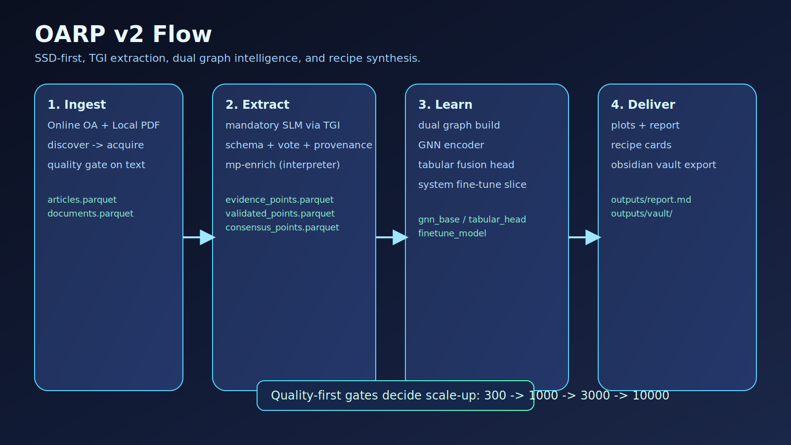
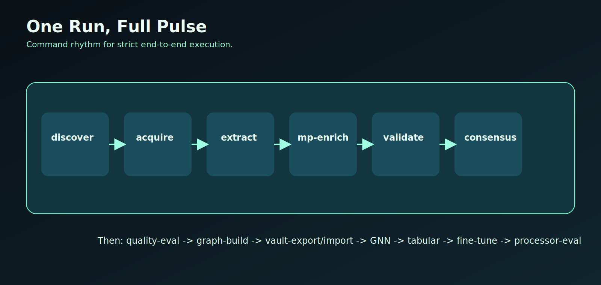
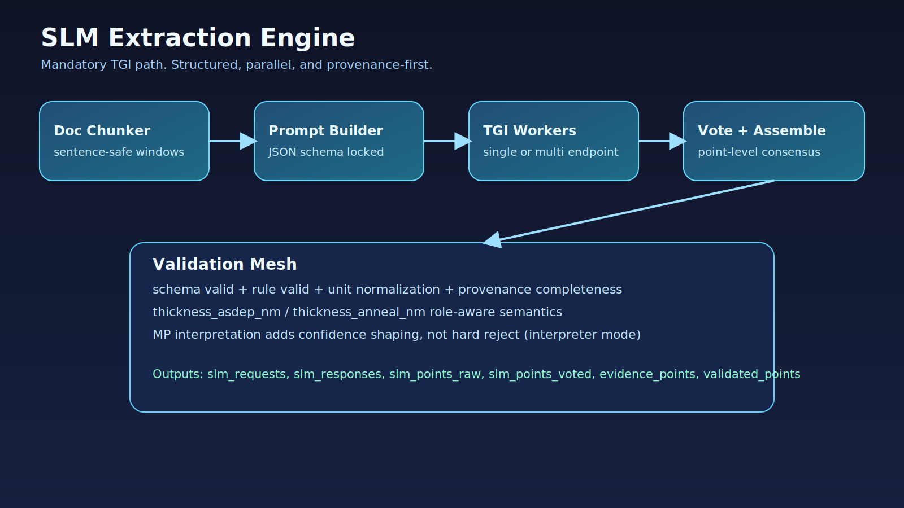
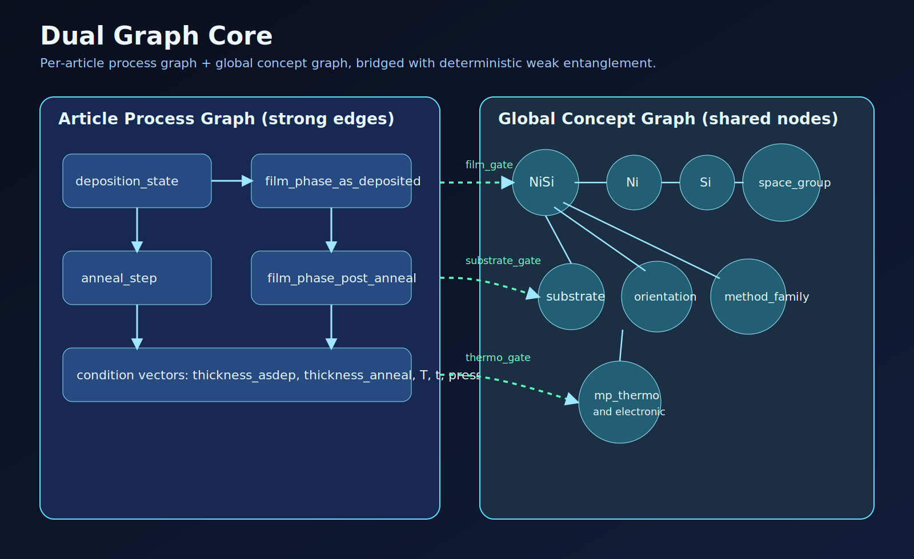
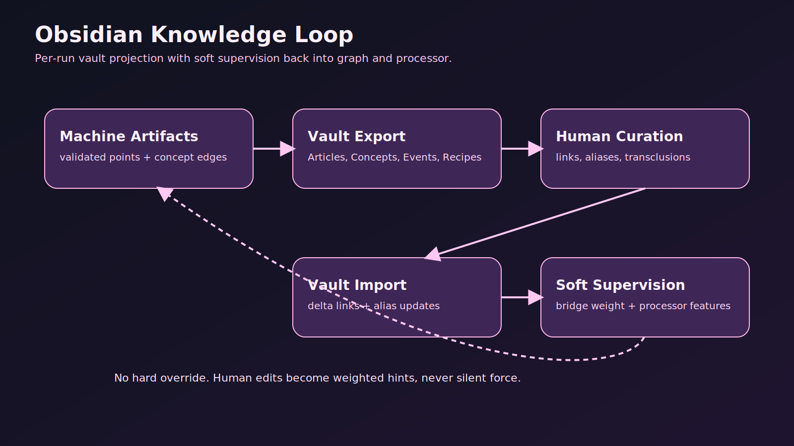

# OARP v2

A smooth, high-fidelity engine for global thin-film research.
It crawls OA papers, extracts structured evidence with mandatory SLM inference, learns a dual graph, and ranks synthesis recipes with traceable citations.

## Visual Core





## How Extraction Actually Works



- TGI-backed SLM extraction is mandatory in strict mode.
- Every accepted point must be provenance-complete.
- MP enrichment is interpreter-first (confidence shaping, non-gating by default).

## How ML Actually Works




- Graph plane: per-article process graph + global concept graph.
- Learning stack: `PyG hetero-GNN -> tabular fusion -> system fine-tune`.
- Fine-tune stage is support-aware and gate-controlled.

## Obsidian-Native Knowledge Loop



- Export run knowledge to vault notes.
- Import curated links/aliases as soft supervision.
- Human edits influence weights, never silently hard-override strict gates.

## Minimal Strict Run

```bash
python3.11 scripts/bootstrap_strict.py --run /tmp/oarp_run --profile strict_full

/tmp/oarp_run/.venv/bin/oarp run-full \
  --spec examples/topic_ni_silicide.yaml \
  --query "nickel silicide thin film phase transition" \
  --out /tmp/oarp_run \
  --extractor-mode slm_tgi_required
```

## Key Outputs

- `artifacts/validated_points.parquet`
- `artifacts/consensus_points.parquet`
- `artifacts/concept_nodes.parquet`
- `artifacts/bridge_edges.parquet`
- `artifacts/processor_eval_metrics.json`
- `outputs/report.md`
- `outputs/vault/`
